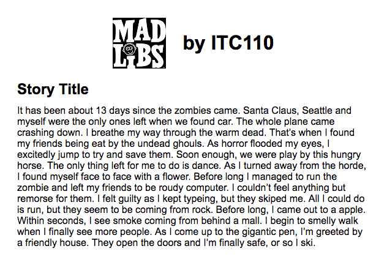

# ITC110_W17
The Winter 2017 - ITC 110 web app in Flask.

## Here is the source code to our class project today:
https://github.com/SeattleCentral/ITC110_W17

## Instructions on setting up a virtualenv:
https://virtualenv.readthedocs.io/en/stable/userguide/

## Flask QuickStart:
http://flask.pocoo.org/docs/0.12/quickstart/

## Our first test run:

